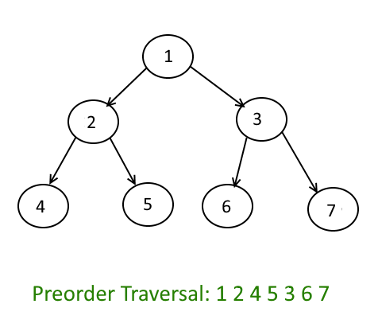

Part of my New Year's resolution is to get better with data structures and algorithms. I never had an in depth course on the topic and have made it a mission to become much better at the topic by the end of the year.

Once of the main sources I'm using to learn is LeetCode. Not only do they have hundreds of problems to work on, but they actually have a pretty good training path to follow to continually improve(for a fee).

Over the next few months my goal is to make a minimum of 3 blog posts a week, each covering a new algorithm. Anyways, on to the topic at hand: **Binary Tree Pre Order Traversal**.

Pre Order Traversal means to visit the root of the tree first. Then, you want to traverse the left subtree, followed by the right subtree. Here is a quick diagram showing the order:



So let me try to show my solution in code:

```javascript
let preorderTraversal = function(root) {
  if (root === null) {
    return []
  }
  let stack = []
  stack.push(root)
  let output = []

  while (stack.length > 0) {
    root = stack.pop()
    if (root) {
      output.push(root.val)
      if (root.right) {
        stack.push(root.right)
      }
      if (root.left) {
        stack.push(root.left)
      }
    }
  }
  return output
}
```
